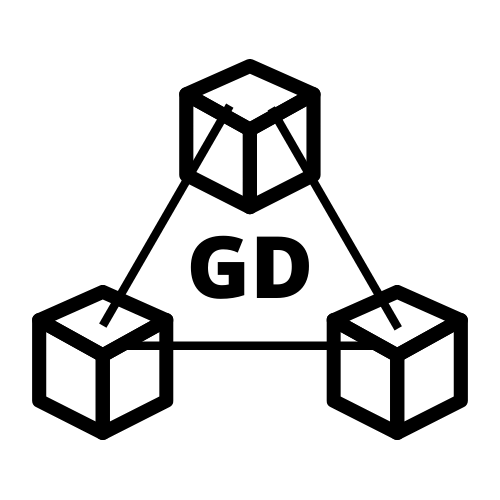

</img>
<h1 style="text-align: center;">GD Module Manager</h1>

 A Nodejs based Command line interface to automate installing modules and dependencies, running setup scripts and launching client modules.

<br/>

# Need for gdmm:

 All the projects comprise of several modules seperated into different repositories. The modules are dependent on each other. A need arose to build a single tool to automate the task of installing and maintaining these interdependent modules. Some modules also require setup after downloading the code(like setting up database tables) which also needed to be automated. gdmm also makes running the applications accessible from anywhere in the file system

<br/>

 Currently gdmm only supports modules built using python. Support will be added in future versions

# Installation
 gdmm can be installed using npm. Run,

```
npm install gdmm -g
```
 to install the package globally (It is recommended to install the package globally).

<br/>

# Usage

 gdmm can be used to install modules along with their dependencies, run custom scripts to setup the modules (for example, running a script to setup database tables ) and launching applications from the command line.

<br/>

## Installing modules

 gdmm can install all python based public modules from [github ganesh-dagadi](https://github.com/ganesh-dagadi/)

 to install a module, run :

```
gdmm -c install -r repository_name -u ganesh-dagadi 
```

 This will install the package in `C:\Users\<username>\gdmm\modules\` also installing all the dependent packages

<br/>

 If you'd like to install the module in the current directory, then add the `-l` tag
```
gdmm -c install -r repository_name -u ganesh-dagadi  -l
```
<br/>

## Running setup scripts

 Setup scripts are used to run a script once after installation. (Running only one script is supported in 1.0.*)

 To run a setup script, navigate to the root of the module you want to setup and run,

```
    gdmm -c setup 
```

 If the script requires **n** arguments, it will ask for input like:

```
Enter, <Argument 1 description> , <Argument 2 description> ,... <Argument n description> seperated by single space => Value1 Value2 ... Valuen
```
 When prompted, enter the values and hit enter. (Having spaces in values is not supported in v1.0.0)

 After the setup is complete, **do not run the setup again**

 *if you see*  `Setup not supported for this module`. *It means that the module does not need any setup*

<br/>

## Launching an application

 gdmm can also launch modules which support running applications. (example running a tkinter based frontend application)

<br/>

 To launch a module you installed locally, navigate to the root of that module and run,

```
gdmm -c run -l
```
<br/>

 To launch a module you installed globally, run the following command (irrespective of current directory)

```
    gdmm -c run -r module_name
```

<br/>

# Creating a gdmm supported module

 You can create your own module supported by gdmm. Create a `json` file called `setup.json` and include the following data as required.

<br/>

## Required keys

<br/>

 1. `name` : "name of your module"

 2. `version` : "Semantic based version"

 3. `author` : "Author name"

 4. `author_email` : "Author email"

<br/>

## Optional keys

 1. `descp` : "Description of the module"

 2. `dependencies`: The dependencies required by the package

```
"dependencies" : [
     {"name" : "package_name" , "version" : "x.y.z" , "pckg_manager" : "pip3"},
     {"name" : "repo_name" , "username" : "githib_username" , "pckg_manager" : "gdmm"}
]
// supported package managers in v1.0.* are pip3 and gdmm
```

 3. `install` : Provide setup functionality using `gdmm -c setup`

 Create a directory in root called `install` and create an installation file

<br/>

 **Note: The current working directory while running `gdmm -c setup` is the root of your module. Therefore, all relative paths from your installation script must begin from root of your application**

<br/>

```
"install": {
    "run" : "your run command", // example:  python ./install/script.py
    "args" : [ // arguments required in your script
        {prompt : "First argument's description"},
        {prompt : "Second argument's description"},
    ]
}
```

 The above args will resolve into : 

```
Enter <First argument's description> , <Second argument's description>, seperated by single space => 
```

 The entered values can be accessed in your script file using `argv`

<br/>

 4. `run` : Provide run functionality to your module

```
    "run" : "run command path_from_root" // example: python main.py
```

<br/>

# Important

 Every module that has a gdmm module as a dependency must include the following code snippet before importing the module

<br/>

## Python:

```
import sys
mod_dir = "C:\Program Files\gdmm\modules"
sys.path.append(mod_dir)
    load_dotenv()
```


